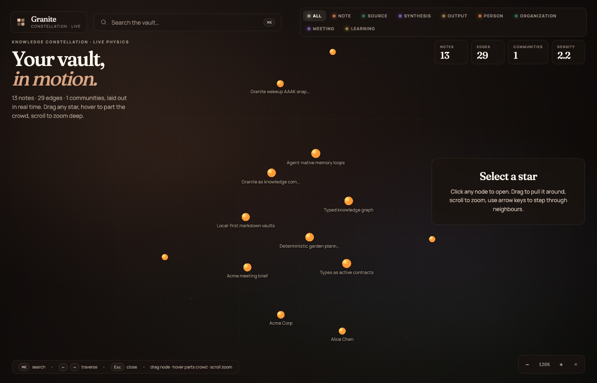
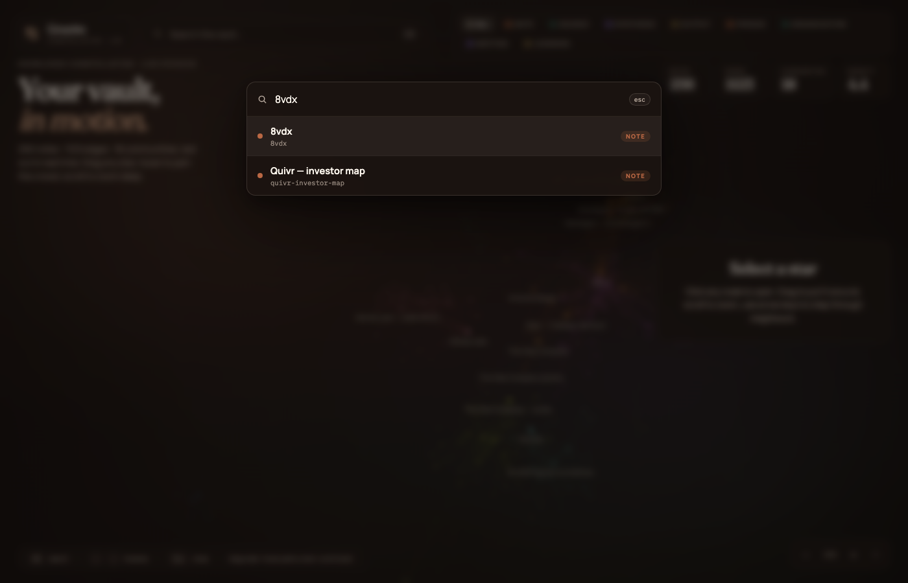
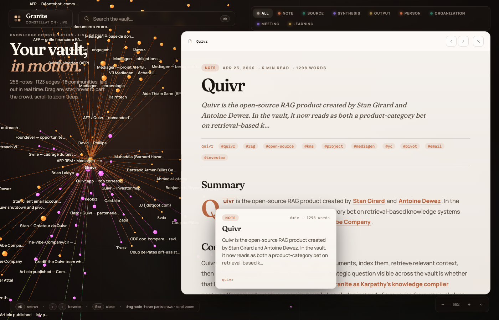
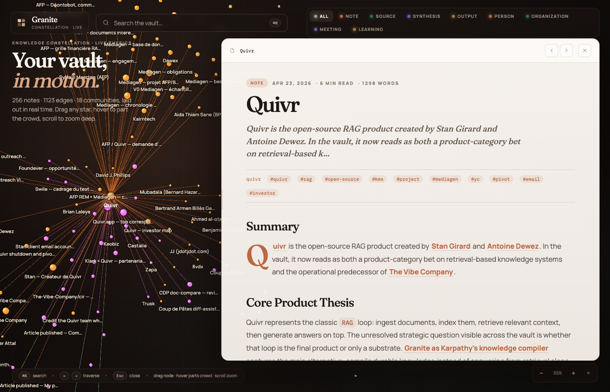

# Granite

<p align="center">
  <a href="https://www.npmjs.com/package/granite-mem"></a>
  <a href="https://www.npmjs.com/package/granite-mem"></a>
  <a href="https://github.com/The-Vibe-Company/Granite/actions/workflows/ci.yml"></a>
  <a href="LICENSE"></a>
  <a href="https://github.com/The-Vibe-Company/Granite/stargazers"></a>
</p>

> **The personal OS your agent runs on.**
> Markdown files. One SQLite index. A typed contract your agent already knows how to operate.

<p align="center">
  
</p>

<p align="center">
  <b>Install it with your agent.</b> Or run it standalone as a local markdown knowledge graph.
</p>

---

## The wow moment

Paste this into **Claude Code**, **Cursor**, or any MCP-capable agent:

````
Install Granite as my personal OS.

1. `npm install -g granite-mem`
2. `granite init --template founder-os`  (vault at ~/.granite)
3. `claude mcp add granite -- granite mcp --vault ~/.granite`
4. Restart yourself so the MCP server loads.
5. Call `granite_wakeup`, then propose three notes you would write
   first based on what you know about me so far. Capture them as
   drafts with --source agent.
````

Sixty seconds later you have a live vault, a connected agent that **knows how to use it**, and three starter notes in `~/.granite/notes/`. No system prompt. No config. No cloud.

That's the thesis of this project.

## See it

<table>
  <tr>
    <td width="50%">
      
      <br>
      <sub><b>Constellation graph.</b> Browse the vault as communities, hubs, and links.</sub>
    </td>
    <td width="50%">
      
      <br>
      <sub><b>Command palette.</b> Search the vault and jump straight into the graph context.</sub>
    </td>
  </tr>
  <tr>
    <td width="50%">
      
      <br>
      <sub><b>Graph-aware reading.</b> Preview notes without losing the surrounding context.</sub>
    </td>
    <td width="50%">
      
      <br>
      <sub><b>Floating reader.</b> Open a note without leaving the constellation.</sub>
    </td>
  </tr>
</table>

## What is Granite?

A local-first markdown store with an opinionated flow. **No AI inside** — just plain files on disk, indexed by SQLite, queried deterministically.

- **Imposed flow.** Capture, compile, query, output, lint. The shape is fixed; the content is yours.
- **Four default note types** — `note`, `source`, `synthesis`, `output`. Add your own in `granite.yml` when your life grows a new shape.
- **A specialized MCP** that teaches your agent how to use the vault. Drop any MCP-capable agent on it and it knows how to operate, no system prompt required.

Your agent brings the intelligence. Granite holds the ground truth.

## Try it standalone

```bash
npm install -g granite-mem
granite init
granite serve
```

That starts with the default knowledge model: `note`, `source`, `synthesis`, and `output`. Add `--template founder-os` when you want people, organizations, meetings, and learnings wired in from the start.

## Agent-native MCP

> "A thin MCP server exposes capabilities. A strong MCP server shapes behavior."

Granite's MCP surface is intention-first:

- `granite_wakeup` to orient
- `granite_research_topic` to inspect existing knowledge before writing
- `granite_query` for structured filters over typed notes
- `granite_compile_context` to assemble a graph-aware brief
- `granite_plan_garden` to decide what to improve next
- `granite_capture_knowledge` to write with protocol fields and type contracts

The point is not to give an agent a file browser. The point is to give it a workflow it can follow.

## Types as active contracts

This is what makes the agent feel native rather than bolted-on.

```yaml
# granite.yml — every note type is an executable contract
note_types:
  meeting:
    folder: notes/meetings
    fields:
      date:         { type: date,     required: true }
      organization: { type: wikilink, target_types: [organization] }
      attendees:    { type: wikilink, target_types: [person] }
    on_create:
      - { action: set_default,       field: date, value: "${today}" }
      - { action: resolve_wikilinks, fields: [organization, attendees], auto_stub: true }
    indexed_fields: [date, organization]
    lifecycle:
      states: [active, archived]
      transitions:
        - { from: active, to: archived, trigger: stale_days, days: 180 }
```

- `set_default` — fills `${today}` automatically
- `resolve_wikilinks + auto_stub` — turns `organization: Acme Corp` into the slug `acme-corp`, creating the org note if missing (with a globally-unique slug so nothing gets silently overwritten)
- `indexed_fields` — makes `granite_query { type: meeting, where: { date: { gte: "2026-01-01" } } }` O(1) and deterministic
- `lifecycle` — `granite doctor` surfaces stale notes so gardening never drifts

Add a type when your life has a new shape. The core stays small. For the formal protocol, see [docs/GRANITE_OBJECT_STANDARD.md](docs/GRANITE_OBJECT_STANDARD.md).

## Templates

```bash
granite init                          # minimal: note / source / synthesis / output
granite init --template founder-os    # + person / organization / meeting / learning
```

`founder-os` is the full personal-OS starter: people you talk to, orgs you work with, meetings you had, things you learned. Eight types, already wired with hooks, indexed fields, and lifecycles. Open `templates/founder-os.yml` — it's 150 lines of pure YAML.

## The hard boundary

Granite will **never**:

- embed an LLM, run prompts, or hold an API key
- compute embeddings or ship a vector store
- run background agents or a scheduler
- add overlapping CLI/MCP endpoints that blur the loop

This is why your agent can be trusted with write access. The vault is a **deterministic substrate**. The intelligence is yours (or Claude's, or GPT's, or whoever you pay this quarter).

## Protocol fields

Every note carries five shared fields so humans and agents share ground truth:

| Field          | Values                                | Purpose                              |
|----------------|---------------------------------------|--------------------------------------|
| `status`       | `inbox` · `active` · `archived`       | operational state                    |
| `source`       | `human` · `agent` · `extraction`      | who wrote it                         |
| `review_state` | `draft` · `reviewed` · `locked`       | editorial state                      |
| `durability`   | `canonical` · `working` · `ephemeral` | keep / may drift / throwaway         |
| `derived_from` | `[slug, …]`                           | provenance for syntheses and outputs |

Your agent reads these before writing and sets them as it works. You inherit a fully auditable trail.

## Local-first, by design

- Markdown files are the source of truth; the SQLite index in `~/.granite/index.db` is derived state and can be rebuilt at any time
- no cloud, no telemetry, no account
- `git init` your vault and you have versioning for free
- `granite serve` gives you a local web UI — browse, search, explore the graph
- `granite daemon start` runs MCP + web UI in one background process

For the full CLI, run `granite --help`. For development, see [CLAUDE.md](CLAUDE.md).

## Roadmap & status

Granite is pre-1.0. The current release is **v0.1.9**, with the major agent-native loop pieces now in place: typed contracts, wakeup snapshots, deterministic garden planning, document import, daemon mode, and the constellation graph.

Read [CHANGELOG.md](CHANGELOG.md) for release history. The product boundary stays fixed: Granite stores and indexes local knowledge; agents bring the intelligence.

## Contributing

Issues and focused PRs are welcome.

For local development, read [CLAUDE.md](CLAUDE.md). The key product rule is simple: no embedded LLM, no vector store, no autonomous scheduler inside Granite.

> Karpathy wrote that there was room for "an incredible new product instead of a hacky collection of scripts" around LLM knowledge bases.
>
> Granite is the product that answers that call.
>
> — [@karpathy on LLM knowledge bases](https://x.com/karpathy/status/2039805659525644595)

## Philosophy

- local-first beats cloud dependence for personal memory
- plain markdown beats proprietary formats
- **types as active contracts** beat types as folders
- tools for humans should also be legible to agents
- protocol belongs in the core; **agent policy belongs outside it**
- a personal OS is a thing you own — not a thing you rent

---

<p align="center">
  <sub>Ship your agent a home. Then give it the keys.</sub>
</p>
